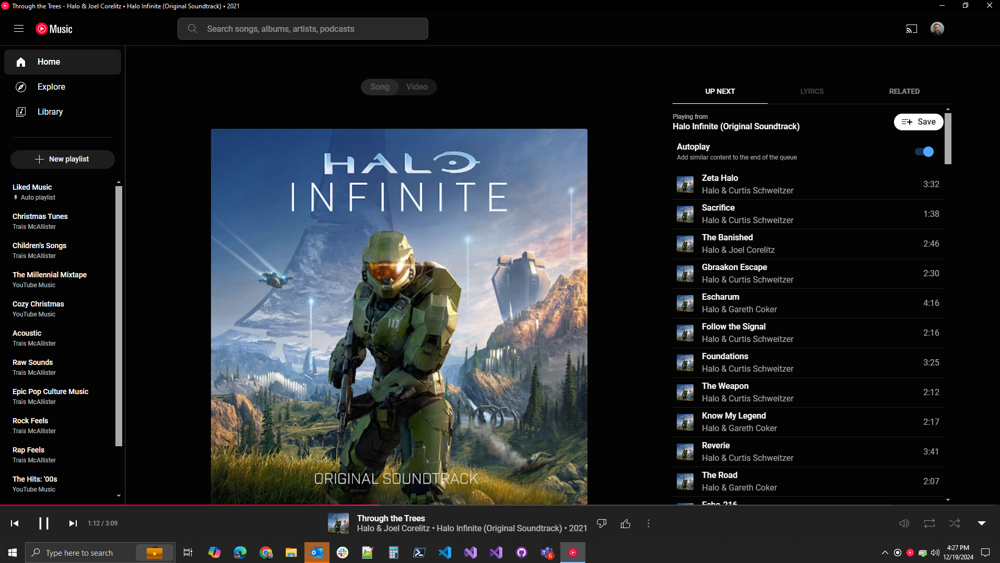
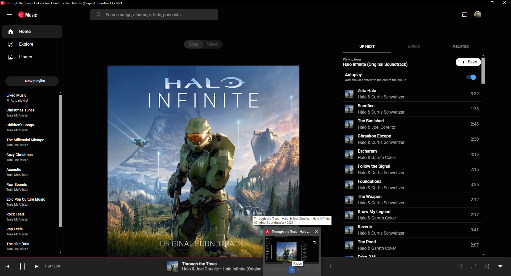
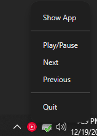

# YouTube Music Mini Player (Adblock Fork)

A lightweight and customizable desktop application for YouTube Music, built using [Electron](https://www.electronjs.org/). This fork adds robust ad-blocking capabilities and advanced system tray customization.

---

## Features

### **Built-in Ad & Tracker Blocker**
- **uBlock Origin + EasyList Integration**: Intercepts advertisements and tracking network requests using the same live filters used by uBlock Origin and EasyList.
- **Weekly Auto-Updates**: Automatically pulls fresh rules from the source repositories once a week on startup to bypass new YouTube anti-adblock scripts.
- **Rules Caching**: Serializes filter lists into a binary cache (`adblocker-engine.bin`) to maintain instant app startup times (~50ms).
- **Runtime Toggle**: Enable or disable the blocker dynamically from the tray menu without restarting the app.

### **Advanced System Tray Controls**
- **Interactive Checkbox Settings**:
  - **Block Ads & Trackers**: Toggles adblocking at runtime.
  - **Minimize to Tray**: When enabled, minimizing the window hides it to the system tray (default is active).
  - **Close to Tray**: When enabled, clicking the Close (×) button hides the window to the tray instead of exiting (default is active).
- **Tray Menu**:
  - Show/Hide the app or floating Mini Window.
  - Playback controls: Play/Pause, Next, and Previous track.
  - Quit the application (bypasses close-to-tray).

### **Media Controls**
- **Taskbar Thumbnail Toolbar**:
  - Play/Pause, Next, and Previous buttons directly accessible from the taskbar.
  - Syncs with the current playback state and updates dynamically.
- **Windows Media Overlay**:
  - Supports the native Windows Media Overlay with title, artist, and album information.

### **Now Playing Notifications**
- Displays notifications when the track changes, including:
  - Song title.
  - Artist name.
  - Album artwork.

### **Dark/Light Theme Adaptive Icons**
- Automatically updates button icons and tray icons to match the system's current light or dark theme.

### **Playback State Sync**
- Dynamically updates the app's controls and tooltips to reflect the current playback state (e.g., "Playing" or "Paused").

---

## Installation

### Prerequisites
1. Install [Node.js](https://nodejs.org/) (version 18 or later).
2. Install [Git](https://git-scm.com/).

### Steps
1. Clone this fork:
   ```bash
   git clone https://github.com/victoria-rose/YouTube-Music-Mini-Player.git
   cd YouTube-Music-Mini-Player
   ```
2. Install dependencies:
   ```bash
   npm install
   ```
3. Start the app in development mode:
   ```bash
   npm start
   ```

---

## Build

To build the app for distribution:

1. Install `electron-builder` (if not already installed):
   ```bash
   npm install electron-builder --save-dev
   ```
2. Build the app:
   ```bash
   npm run build
   ```
3. Find the distributable files in the `dist` directory.

---

## Usage

- **Run the App**: Double-click the executable after building.
- **Minimize to Tray**: Press the minimize button on the window.
- **Tray Menu**:
  - **Show App**: Reopens the main app window.
  - **Play/Pause, Next, Previous**: Controls playback.
  - **Quit**: Exits the app.

---
### Key Features in Code
- **Media Session API**: Used to integrate with Windows Media Overlay.
- **Electron's Thumbnail Toolbar**: Adds taskbar media controls.
- **Dynamic Theme Detection**: Updates icons based on light/dark mode.

---

## Contributing

Contributions are welcome! Please:
1. Fork the repository.
2. Create a new branch:
   ```bash
   git checkout -b feature-name
   ```
3. Make your changes and commit them:
   ```bash
   git commit -m "Description of changes"
   ```
4. Push to your branch:
   ```bash
   git push origin feature-name
   ```
5. Open a pull request.

---

## Future Improvements
- Add support for custom hotkeys.
- Implement additional playback features (e.g., shuffle, repeat).

---

## Screenshots





---

## Acknowledgments

- [Electron](https://www.electronjs.org/) for powering the app.
- [YouTube Music](https://music.youtube.com/) for being the core platform.

